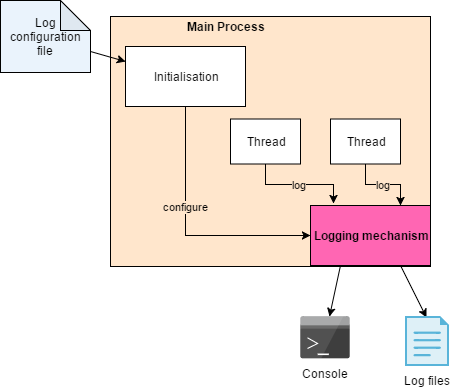
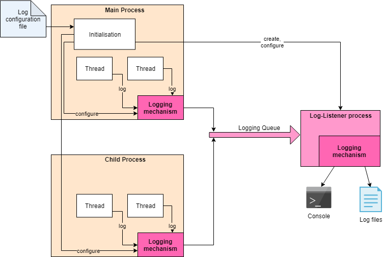

## Logging in a Multi-tasking Environment

Logging is a very useful feature in production code.
By including logging output, you can:

* Configure a product to capture errors and warning to log files, which can be sent back to the developers to help diagnose errors;
* Include low-level debugging output that can be turned on, without changing the code, using a logging configuration file.
You might for example ask a user to turn on "debug" level logging of a specific class to help you diagnose an issue they are experiencing.

This package aims to facilitate easy initialisation and configuration of logging.
It provides a mechanism that transparently works in a multi-processing environment.

### Usage 

The best way to configure logging is to call `LoggingUtils.init_logging()` at the start of your program.
This takes a parameter which is a logging file, in YAML format.
If called without parameters, the file `logging_dev.yaml` will be used, which contains settings suitable for use during development.
Another file provided is `logging_production.yaml` which logs errors and warnings to timestamped, "rotating" log files as well as to the console, which may be useful in a product.

### Implementation 

Logging in a single-process application is illustrated below.

The main program configures the logging mechanism, which filters and writes log records to the configured destinations, such as to the console and to log files.
The logging mechanism also correctly interleaves output from multiple threads.

Unfortunately, this all goes wrong in a multi-process application unless a lot of care is taken.
This is because:

* Each process has its own logging mechanism.
If multiple instances try to write to the console, the output will get messed up.
If they try to write to log files, there will be errors and lost data because multiple processes cannot successfully update the same files.
* Configuring logging only affects the process in which it is done.
Other processes will not be affected and will keep their default logging behaviour (logging warnings and errors to the console).

PUMA solves these issues by delegating all logging to a dedicated process, as illustrated below.

This architecture is constructed the first time an instance of `ProcessRunner` is initialised, and is torn down when the last instance is destroyed.

The logging configuration applied in the main process is transferred to the Log-Listener Process, which becomes responsible for all log output.
Log output from the main process and all child processes (and grandchild processes etc.) is directed to a queue, which the Log-Listener Process services.
The logging mechanism in the main and child processes continues to filter log output according to the log configuration, so that irrelevant log messages are not placed on the queue. 

Provided that processes are run using `ProcessRunner`, this mechanism will operate transparently behind the scenes and the application programmer needs do nothing to make it work.
